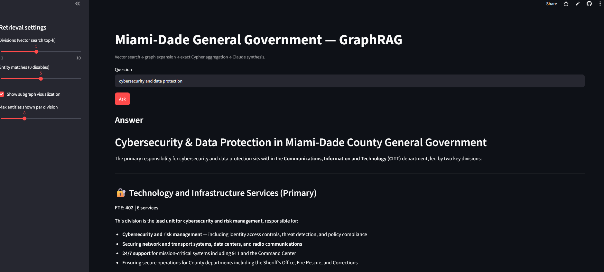
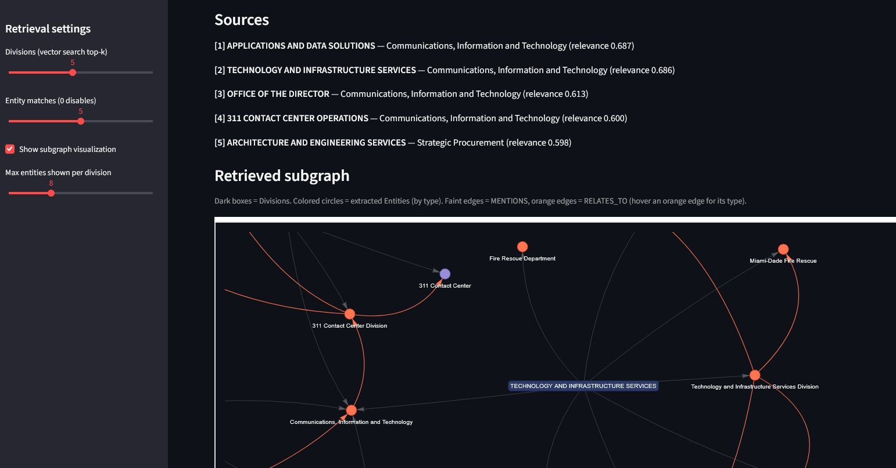

# Miami-Dade GraphRAG

GraphRAG over Miami-Dade County's General Government sector budget data, backed by Neo4j Aura.

**[▶ Live demo](https://graphrag-miamidade-demo.streamlit.app/)** — ask a natural-language question and watch vector search → graph expansion → exact Cypher aggregation → Claude synthesis, with the retrieved subgraph rendered live.

*Synthesized answer, grounded in the retrieved divisions with exact FTE figures:*



*The retrieved subgraph — Divisions (boxes) and their extracted Entities (colored by type), with MENTIONS and RELATES_TO edges:*



## Architecture

```
(Sector)-[:HAS_DEPARTMENT]->(Department)-[:HAS_DIVISION]->(Division)
(Division)-[:MENTIONS]->(Entity)-[:RELATES_TO]->(Entity)
```

- **Phase 1 — Structural backbone**: `build_gg_workbook.py` extracts departments/divisions/FTE/services from source PDFs (`Department Narratives/`) into `General_Government.xlsx`; `load_gg_graph.py` loads it into Neo4j; `add_gg_budget.py` syncs budget/FTE properties without touching Phase 2/3 data.
- **Phase 2 — Entity extraction**: `extract_gg_entities.py` uses Claude to extract typed entities (Service, Population, Location, Agency, Asset, Regulation) and relationships per division. `merge_populations.py` dedupes near-duplicate entities.
- **Phase 3 — Retrieval**: `embed_gg_divisions.py` builds a local-embedding vector index over divisions. `retrieve_gg.py` answers natural-language questions: vector search → graph expansion → exact Cypher aggregation → Claude synthesis with citations.
- **Streamlit app**: `streamlit_app.py` wraps `retrieve_gg.py` in a UI, with an interactive pyvis subgraph (retrieved Divisions + their extracted Entities) alongside the synthesized answer.

## Setup

```
python -m venv .venv
.venv\Scripts\Activate.ps1
pip install -r requirements.txt
```

Create a `.env` (see `.env.example`) with `ANTHROPIC_API_KEY`, `NEO4J_URI`, `NEO4J_USER`, `NEO4J_PASSWORD`. **Do not** put `.env` inside a cloud-synced folder (OneDrive/SharePoint) — secrets there can be scanned/removed by corporate DLP.

If your `.env` lives outside this repo's directory tree, set `GRAPHRAG_ENV_PATH` to its full path (all scripts call `load_dotenv(os.environ.get("GRAPHRAG_ENV_PATH"))`, which falls back to `load_dotenv()`'s default cwd/parent-directory search when unset).

## Run

```
python load_gg_graph.py          # Phase 1
python add_gg_budget.py          # Phase 1 budget sync
python extract_gg_entities.py    # Phase 2
python merge_populations.py      # Phase 2 cleanup
python embed_gg_divisions.py     # Phase 3
python retrieve_gg.py "your question here"
streamlit run streamlit_app.py   # UI
```

All scripts are idempotent/resumable (safe to re-run).

## Deploying the Streamlit app

On [Streamlit Community Cloud](https://streamlit.io/cloud), point a new app at this repo /
`streamlit_app.py`, then add `ANTHROPIC_API_KEY`, `NEO4J_URI`, `NEO4J_USER`, `NEO4J_PASSWORD` to the
app's Secrets manager (never in the repo). Locally, `streamlit_app.py` falls back to the same `.env`
the CLI scripts use.
